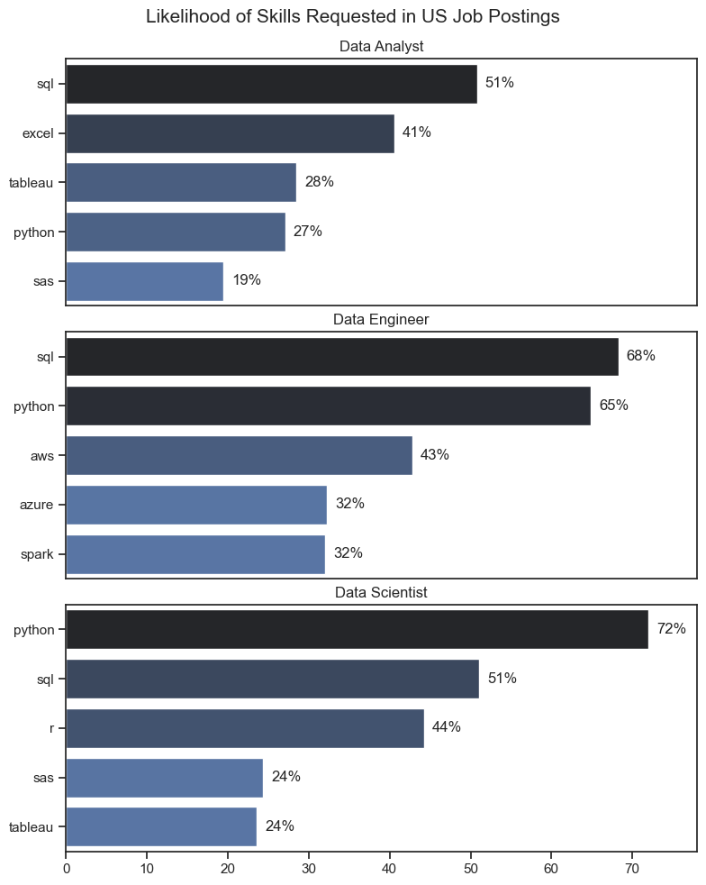
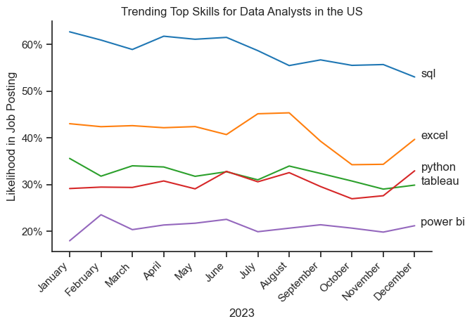
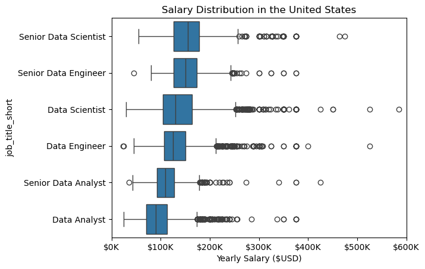
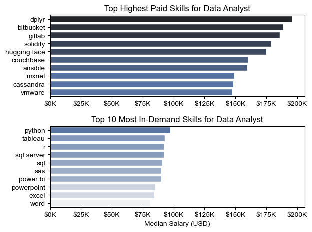
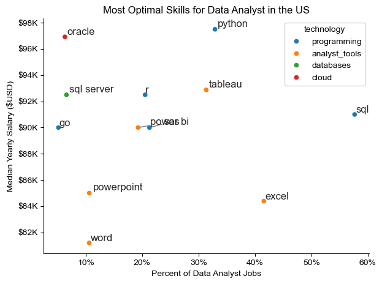

## Overview

Welcome to my analysis of the data job market, focusing on data analysis roles. This was created out of desire to navigate and understand the job market more effectively. It delivers into the top paying and in demand skills to help find optimal job opportunities for data analysts.

The data set (**I got it from hugging face website**) from [luke Barousse](lukebarousse/data_jobs) which provides a foundation for my analysis, containing detailed information on job titles, salaries, locations, and essential skills. Through a series of python scripts, I explore key questions such as the demanded skills, salary trends, and the intersection of demand and salary in data analytics.

## The Questions

Below are the questions I want to answer in my project:
   
  1. What are the skills most in demand for the top 3 most popular data roles?
  2. How are in demand skills trending for Data Analysts?
  3. How well do jobs and skills pay for Data Analysts?
  4. What are the optimal skills for data analysts to learn?(High Demand and High Paying)

## Tools I Used

For my deep dive into the data analyst job market, I harnessed the power of several key tools:

**Python:** The backbone of my analysis, allowing me to analyze the data and find critical insights.

  **-Pandas Library:** The python library used to analyze the data.

  **-Matplotlib Library:** The library I used to visualize my data.

  **-Seaborn Library:** The library I used to create more advanced visuals.

**Jupyter Notebooks:** The tool i used to run my python scripts which let me easily include my notes and analysis.

**Visual Studio Code:** My go to for excuting my python scripts.

**Git & GitHub:** Essential for version control and sharing my python code and analysis, ensuring collaboration and prpoject tracking.


## Data Preparation and Cleanup

This section outlines the steps taken to prepare the data for analysis, ensuring accuracy and usability.

### Import and Clean Up data

I start by importing necessary libraries and loading the dataset, followed by initial data cleaning tasks to ensure everything is set

```
{
  # importing libraries

import ast
import pandas as pd
import seaborn as sns
from datasets import load_dataset
import matplotlib.pyplot as plt

#loading data
dataset=load_dataset('lukebarousse/data_jobs')
df=dataset['train'].to_pandas()

#data cleanup $ convert job skills column from a string to a list
df['job_posted_date']=pd.to_datetime(df['job_posted_date'])
df['job_skills']=df['job_skills'].apply(lambda x:ast.literal_eval(x) if pd.notna(x) else x)
}
```
### Filter United States Jobs

To focus my analysis on the U.S. job market, I apply filters to the dataset, narrowing down to roles based in the United States.

```
{
  df_us=df[df['job_country']=='United States']
}
```

### The Analysis

Each jupyter notebook for this project aimed at investigating specific aspects of the data job market. Here's how I approached each question:

### 1. **What are the skills most in demand for the top 3 most popular data roles?**
To find the most demad skills for the top 3 most popular data roles. I filtered out those positions by which ones were teh most popular, and got the top 5 skills for these top 3 roles. This query highlights the most popular job titles and their top skills, showing which I should pay attention to depending on the role i am targeting.

View my notebook with detailed steps here:[2_Skills_Demand.ipynb](3_Project\2_Skills_Demand.ipynb)

**Visualize Data**

```
{
  fig, ax=plt.subplots(len(job_titles),1, figsize=(8,10))
sns.set_theme(style='ticks')

for i, job_title in enumerate(job_titles):
  df_plot=df_skills_perc[df_skills_perc['job_title_short']==job_title].head(5)
  sns.barplot(data=df_plot, x='skill_percent', y='job_skills', ax=ax[i], hue='skill_count', palette='dark:b_r') 
  ax[i].set_title(job_title)
  ax[i].set_xlabel('')
  ax[i].set_ylabel('')
  ax[i].get_legend().remove()
  ax[i].set_xlim(0,78)
  for n, v in enumerate (df_plot['skill_percent']):
    ax[i].text(v+1, n, f'{v:.0f}%', va='center')

  if i !=len(job_titles)-1:
    ax[i].set_xticks([])

fig.suptitle('Likelihood of Skills Requested in US Job Postings', fontsize=15)
fig.tight_layout(h_pad=0.5) # fix teh overlap
plt.show()
}
```

**Results**



### Insights

- Python is a versatile skill, highly demanded across all three roles, but most prominently for Data Scientist (72%) and Data Engineers (65%).
- SQL is the most requested skill for Data Analyst and Data Scientists, with it over half the job postings for both roles. For Data Engineers, Python is the most sought after skill, appearing in 68% of job postings.
- Data Engineers require more specialized technical skills (AWS, Azure, Spark) compared to Data Analysts and Data Scientists who are expected to be proficient in more general data management and analysis tools (Excel, Tableau).

### 2.**How are in demand skills trending for Data Analysts?**

### Visualize Data

```
{
  from matplotlib.ticker import PercentFormatter
ax=plt.gca()
ax.yaxis.set_major_formatter(PercentFormatter(decimals=0))

plt.xticks(rotation=45, ha='right')  # Rotate month labels
plt.tight_layout()                   # Adjust spacing automatically

plt.legend().remove()

for i in range(5):
  plt.text(11.2, df_plot.iloc[-1, i], df_plot.columns[i])
}
```
### Results


*Bar graph visualizing the trending top skills for data analysts in the US in 2023.*

### Insights:

- SQL remains the most consistently demanded skill throughout the year, although it shows a gradual decrease in demand.
- Excel experienced a significant increase in demand starting around september, surpassing both Python and Tableau by the end of teh year.
- Both Python and Tableau show relatively stable demand throughout the year with some flactuations but remain essential skils for data analyst. Power BI, whille less demand compared to the others, shows a slight upward trend towards the year's end.

### 3.**How well do jobs and skills pay for Data Analysts?**

#### Visualize Data

```
{
  sns.boxplot(data=df_US_top6, x='salary_year_avg', y='job_title_short', order=job_order)
plt.title('Salary Distribution in the United States')
plt.xlabel('Yearly Salary ($USD)')

# add $ sign to x axis and divide it by 1000
ax=plt.gca()
ax.xaxis.set_major_formatter(plt.FuncFormatter(lambda x, 
pos: f'${int(x/1000)}K'))

#Filter the X axis range from 0 to 600000
plt.xlim(0,600000)

plt.show()
}
```

#### Results

*Box plot visualizing the salary distributions for the top 6 data job titles.*

#### Insights

- There's a significant variation in salary ranges across different job titles. Senior Data Scientist postions tend to have the highest salary potential, wit up to $600k, indicating the high value placed on advanced data skills and experience in teh industry.

- Senior Data Engineer and Seior Data Scientist roles show a considerable number of outliers on the higher end of the salary spectrum, suggesting that exceptional skills or circumstances can lead to high pay in these roles. In contrast, Data Analyst roles demonstrate more consistency in salary, with fewer outliers.

- The median salaries increase with the seniority and specializations of the roles. Senior roles (Senior Data Scientist, Senior Data Engineer) not only have higher median salaries but also larger differences in typical salaries, reflecting greater variance in compensation as responsibilities increase.

### Highest Paid & Most demanded Skills for Data

#### Visualize Data

```
{
  # Top Highest Paid Skills for Data Analyst

sns.barplot(data=df_DA_top_pay, x='median', y=df_DA_top_pay.index, ax=ax[0], hue='median', palette='dark:b_r')
ax[0].legend().remove()

# df_DA_top_pay.plot(kind='barh', y='median', ax=ax[0], legend=False)
ax[0].set_title('Top Highest Paid Skills for Data Analyst')
ax[0].set_ylabel('')
ax[0].set_xlabel('')
ax[0].xaxis.set_major_formatter(plt.FuncFormatter(lambda x, pos: f'${int(x/1000)}K'))

# Top 10 Most In-Demand Skills for Data Analyst

sns.barplot(data=df_DA_skills, x='median', y=df_DA_skills.index, ax=ax[1], hue='median', palette='light:b')
ax[1].legend().remove()

# df_DA_skills.plot(kind='barh', y='median', ax=ax[1], legend=False)
ax[1].set_xlim(ax[0].get_xlim())
ax[1].set_title('Top 10 Most In-Demand Skills for Data Analyst')
ax[1].set_ylabel('')
ax[1].set_xlabel('Median Salary (USD)')
ax[1].xaxis.set_major_formatter(plt.FuncFormatter(lambda x, pos: f'${int(x/1000)}K'))

fig.tight_layout()

}
```

#### Results

*Two separate bar graphs visualizing the highest paid skills and most in demand skills for data analysts in the US.*

#### Insights

- The top graph shows specialized techniical skills like 'dplyr', 'Bitbucket', and 'Gitlab' are associated with higher salaries, some reaching up to $200k, suggesting that advanced technical proficiency can increase earning potential.
- The bottom graph highlights that foundational skills like 'Excel', 'PowerPoint', and 'SQL' are the most in-demand, even though they may not offer the highest salaries. This demonstrates the importnace of these core skills for employability in data analysis roles.
- There's a clear distinction between the skills that are highest paid and those that are most in demand. Data analysts aiming to maximize their career potential should consider developing a diverse skill set that includes both high paying specialized skills and widely demanded foundational skills.

### 4. What are the optimal skills for data analysts to learn?(High Demand and High Paying)

#### Visualize Data

```
{
  from adjustText import adjust_text
import matplotlib.pyplot as plt

#df_plot.plot(kind='scatter',x='skills_percent',y='median_salary')

sns.scatterplot(
    data=df_plot,
    x='skills_percent',
    y='median_salary',
    hue='technology'
)

sns.despine()
sns.set_theme(style='ticks')

texts = []

for i, txt in enumerate(df_DA_skills_high_demand.index):
    texts.append(
        plt.text(
            df_DA_skills_high_demand['skills_percent'].iloc[i],
            df_DA_skills_high_demand['median_salary'].iloc[i],
            txt
        )
    )

adjust_text(
    texts,
    arrowprops=dict(arrowstyle="->", color='grey', lw=1)
)

from matplotlib.ticker import PercentFormatter
ax = plt.gca()
ax.yaxis.set_major_formatter(
    plt.FuncFormatter(lambda y, pos: f'${int(y/1000)}K')
)
ax.xaxis.set_major_formatter(PercentFormatter(decimals=0)
)

plt.xlabel('Percent of Data Analyst Jobs')
plt.ylabel('Median Yearly Salary ($USD)')
plt.title('Most Optimal Skills for Data Analyst in the US')

plt.tight_layout()
plt.show()
}
```

*A scatter plot visualizing the most optimal skills (high paying & high demand) for data analysts in the US.*

#### Insights
- The scatter plot shows that most of the 'programming' skills (colored blue) tend to cluster at higher salary levels compared to other categories, indicating that programming expertise might offer greater salary benefits within the data analytics field.
- Analyst tools (colored green), including Tableau and Power BI, are prevalent in job postings and offer competitive salaries, showing that visualization and data analysis software are crucial  for urrent data roles. This category not only has god salaries but is also versatile across different types of data tasks.
- The database skills (colored orange), such Oracle and SQL Server, are associated with some of the highest salaries among data analyst tools. This indicates a significant demand and valuation for data management and manipulation expertise in the industry.


### Conclusion
This exploration into the data analyst job market has been incredibly informative, highlighting the critical skils and trends that shape this evolving field. The insights i got enhance my understanding and provide actionable guidance for anyone looking to advance their career in data analytics. As the market continues to change, ongoing analysis will be essential to stay ahead in data analytics. This project is good foundation for future explorations and underscores the importance of continuous learning and adaptation in the data field.